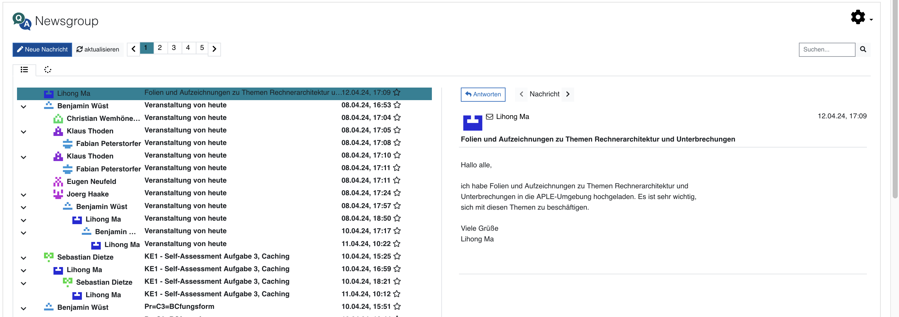
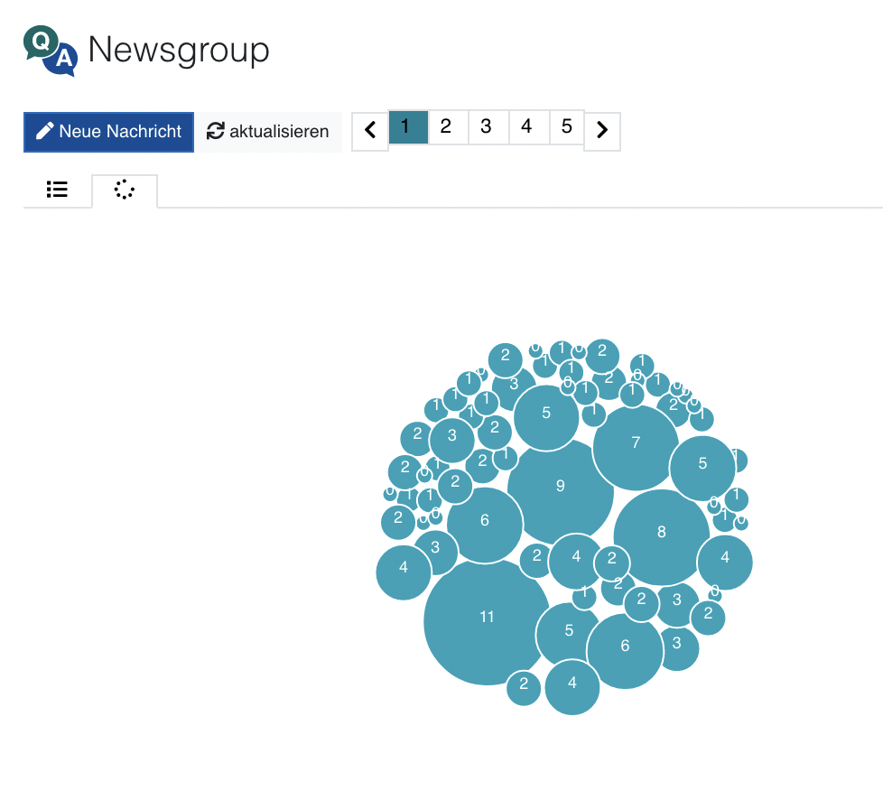

##  Conversion: socket- in place of imap functions  ##

<!-- TODO:
- upload to zenodo
- link to the tex2html converter and mention footnotes
- provide example HTML structures for footnotes, references, images, tables, and headlines in separate document
- set tag 'latest'
- done: make animation `ffmpeg -ss 00:00:12.000 -i usenet.mov -pix_fmt rgb24 -r 10 -s 720x480 -t 00:02:38.000 usenet.gif`
-->


<br>
<div align="center">





</div>

<br>
<h1 align="center">Usenet</h1>

## *Usenet* is a moodle plugin for reading and writing posts in a newsgroup. 

*Usenet* (mod_usenet) ist ein einfach zu verwendender 

<!-- development-related badges -->
[](https://github.com/CATALPAresearch/mod_usenet/commit-activity)
[](https://github.com/CATALPAresearch/mod_usenet/commit/)
[](https://github.com/CATALPAresearch/mod_usenet/contributors/)
[](https://github.com/CATALPAresearch/mod_usenet/issues/)
[](http://perso.crans.org/besson/LICENSE.html)


<!-- Maturity-related badges 
see: https://github.com/mkenney/software-guides/blob/master/STABILITY-BADGES.md
-->
[](https://github.com/mkenney/software-guides/blob/master/STABILITY-BADGES.md#mature)


<!-- AI-related and LA-related badges -->
<!-- 
https://nutrition-facts.ai/

Privacy Ladder Level
Feature is Optional
Model type
Base model
Base Model Trained with Customer Data
Customer Data is Shared with Model Vendor
Training Data Anonymized
Data Deletion
Human in the Loop
Data Retention
Compliance
-->


<br><br>

<p align="center">
  <a href="#key-features">Key Features</a> •
  <a href="#how-to-use">How To Use</a> •
  <a href="#download">Download</a> •
  <a href="#credits">Credits</a> •
  <a href="#related">Related</a> •
  <a href="#citation">Citation</a> •
  <a href="#license">License</a>
</p>


## Key Features

The main features *Usenet* are:

* fully integrated newsgroup client for Moodle
* sploit pane for browsing discussion threads
* full-text search
* individual user icons (identicons)
* mobile friendly design
* low level socket communication with NNTP, this ensures compatibility for servers which do not have the php_imap lib installed


## Roadmap and Limitations
**Roadmap**
* [ ] setup vue using webpack 5
* [ ] further code revision
* [ ] Further data visualizations are under consideration
* [ ] library file / socket function collection (socketcon.php)
    *   [ ] error handling on all new functions
    *   [ ] user feedback on error -> display message
* [ ] Set up session/connection monitor. Right now each imap/nntp function opens up a new connection to the server


**Limitations**
- As proposed in the original RFC mod_usenet doesn't support images. Images can be neither displayed nor send. 

## How To Use

To clone and run this application, you'll need [Git](https://git-scm.com) and [npm](http://npmjs.com) installed on your computer. From your command line:

```bash
# Clone this repository to /your-moodle/mod/
$ git clone git@github.com:catalparesearch/mod_usenet.git

# Rename the folder to 'usenet'
$ mv mod_usenet usenet

# Go into the repository
$ cd usenet

# Install dependencies
$ npm install

# Build the plugin by transpiling the vue code into javascript
$ npm run build

# Open the page https://<moodle>/admin/index.php?cache=1 and follow the install instructions for the plugin or
$ php admin/cli/uninstall_plugins.php --plugins=mod_usenet --run

# To install the *Usenet* plugin afterwards, copy the repository downloaded in the 1. step into the `mod` folder in the folder your Moodle installation is located in replacing the current `mod/usenet` folder containing the regular *Page* plugin. Now, login to your Moodle running as an administrator. The install/update GUI should open automatically. Just follow the steps the GUI presents to you and you should have installed the *Usenet* plugin successfully afterwards. As an alternative to using the GUI for installation, you can also run the update script from within the folder of your Moodle installation:
$ php admin/cli/upgrade.php

# Open a Moodle course of you choice and add usenet as an activity to your course.

# Configure the newsgroup server and select a newsgroup, e.g.
feunews.fernuni-hagen.de

Newsgroups tested with
1.  misc.test
2.  feu.cafe
3.  feu.informatik.kurs.1801


```

## Download

You can [download](https://github.com/catalparesearch/mod_usenet/releases/tag/latest) the latest installable version of *Usenet* for Moodle 3.11.

## Getting into Development
The main client code can be found at amd/src/ while the server code is located at classes/php/.
Grunt is being used for transpilation of JS code:
* `grunt plugin-build` transpiles all js code
* `grunt plugin-check` run js linter
* `grunt plugin-css` bundles and minifies css files
* `grunt plugin-all` handles css and build tasks mentioned above


## Emailware

*Usenet* is an [emailware](https://en.wiktionary.org/wiki/emailware). Meaning, if you liked using this plugin or it has helped you in any way, I'd like you send me an email at <niels.seidel@fernuni-hagen.de> about anything you'd want to say about this software. I'd really appreciate it!

## Credits

This software uses the following open source packages:
[vue.js](https://vuejs.org/), 

## Citation

Seidel, N., Friedrich, K., & Patzer, R.. (2024). Usenet - A usenet client for Moodle. https://doi.org/10.17605/OSF.IO/AK5JS

> @misc{Seidel2024-MoodleUsenet,
author = {Seidel, Niels and Friedrich, Konstantin and Patzer, Rudolf},
doi = {10.17605/OSF.IO/AK5JS},
keywords = {P-APLE-II,open data,software},
title = {{Usenet - A usenet client for Moodle}},
url = {https://github.com/CATALPAresearch/mod{\_}usenet},
year = {2024}
}


## You may also like ...

* [format_serial3](https//github.com/catalparesearch/format_serial3) - Learning Analytics Dashboard for Moodle Courses
* [mod_usenet](https//github.com/catalparesearch/mod_usenet) - Usenet client for Moodle
* [local_ari](https//github.com/catalparesearch/local_ari) - Adaptation Rule Interface
* [mod_hypercast](https://github.com/nise/mod_hypercast) - Hyperaudio player for course texts supporting audio cues, text2speech conversion, text comments, and collaborative listining experiences 
* [tex2html]() - Convert LaTeX to HTML *Usenet* format

## License

[GNU GPL v3 or later](http://www.gnu.org/copyleft/gpl.html)


## Contributors
* Niels Seidel [@nise81](https://twitter.com/nise81)
* Rudolf Patzer <rpatzer@gmx.de>
* Konstantin Friedrich <konstantfriedrich@gmail.com>


---
<a href="https://www.fernuni-hagen.de/english/research/clusters/catalpa/"></a>
<a href="https://www.fernuni-hagen.de/"></a>


